## 1. 项目概述

该项目是一个按照分布式文件系统架构设计，包含前端、后台管理系统和数据节点。
其中前端面向广大用户，提供文件下载、文件操作等功能，
后台管理系统面向管理员，提供文件管理、节点管理等功能，
数据节点主要用于分布式节点上，为后台管理系统提供数据支持。
下面分别介绍具体业务功能。

### 1.1 客户端
其主要业务功能如下图所示：

各功能模块具体内容如下：

- **个人信息**

    用户可以使用该功能来查看或修改自己的信息，例如邮箱、密码、工作单位、工作地址、手机号等。

- **更新通知**

    用户可以通过这个功能收到后台对于文件系统的更改通知。

- **文件检索**
    
    用户可以通过这个功能检索到自己想要文件。

- **文件下载**

    用户可以通过这个功能下载文件。

- **任务提交**

    用户可以通过这个功能编辑自己定制化代码交付给后台去执行。 

- **结果查看**

    用户可以通过这个功能查看自己提交的任务执行结果。

### 1.2 后台管理系统

其主要业务功能如下图所示：

各功能模块具体内容如下：

- **心跳信息管理**

    后台管理系统作为元数据节点，收集各个数据节点发送的心跳信息，并对心跳信息进行解析。

- **文件信息管理**

    该功能主要是对数据节点中的文件进行管理，包括其重命名、删除、移动以及目录结构等。

- **后台系统用户管理**

  该模块用于管理后台系统的用户账户信息，管理员可以创建、编辑、删除、禁用账户信息。

- **客户端用户管理**

  这个模块负责管理移动端用户的信息。管理员可以查看用户信息，处理账户相关问题。

### 1.3 数据节点

其主要业务功能如下图所示：

各功能模块具体内容如下：

- **心跳**

    该功能主要负责定期向后台管理系统发送数据节点心跳信息。

- **文件管理**

    该功能主要负责管理本地数据，并将其元数据更新到后台管理系统中，提供下载功能。

### 1.4 核心业务流程

本项目的核心业务流程为 加入集群、退出集群、心跳检测、文件下载功能。

## 2. 数据库设计

## 3. 接口定义

## 4. 开发准备